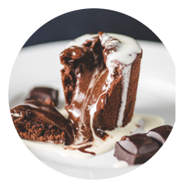
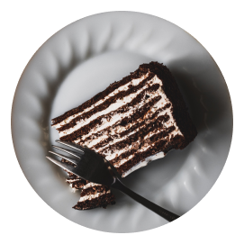
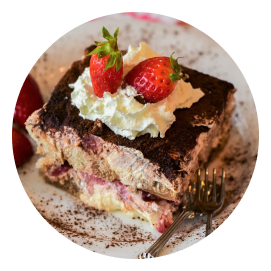
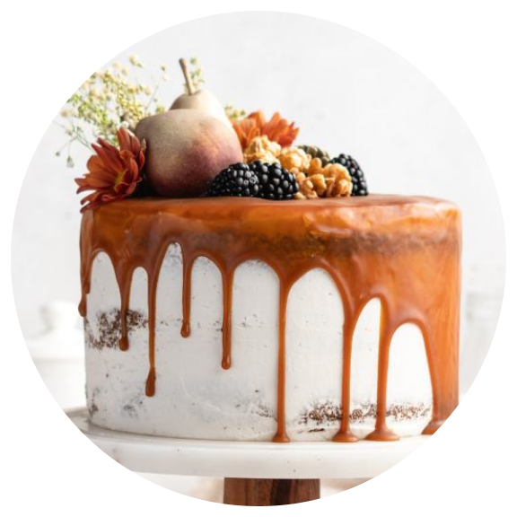
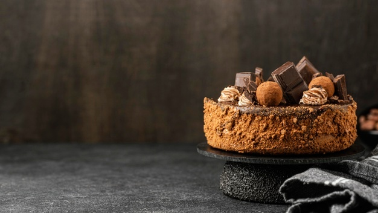

<div align="center">
  
  <h1>Dulce Placer</h1>
  <p><strong>Pasteleria artesanal a pedido</strong></p>
  <p>
    Tortas, cupcakes y postres personalizados para celebraciones, regalos y eventos.
  </p>
</div>

<p align="center">
  
  
  
</p>

---

## Vista general

Dulce Placer es una landing page para una pasteleria local que ofrece productos a pedido.
El sitio presenta:

- Catalogo de sabores y opciones destacadas.
- Promociones y propuestas para eventos.
- Testimonios de clientes.
- Llamados a la accion para cotizar pedidos.

---

## Tecnologias usadas

<p align="center">
  
</p>

<p align="center">
  
  
  
  
</p>

---

## Galeria del proyecto

<p align="center">
  
  
  
</p>

<p align="center">
  
  
  
</p>

---

## Estructura del proyecto

```text
.
|-- index.html
|-- README.md
`-- assets/
    |-- css/
    |   `-- style.css
    |-- js/
    |   `-- main.js
    `-- images/
        |-- logo.png
        |-- cake1.png
        |-- cake2.png
        |-- cake3.png
        `-- ...
```

---

## Como ejecutarlo en local

1. Clona el repositorio.
2. Abre la carpeta en VS Code.
3. Ejecuta un servidor local (por ejemplo, con Live Server) y abre el sitio.

Tambien puedes abrir `index.html` directamente, pero con servidor local tendras una mejor experiencia durante desarrollo.

---

## Deploy

### Vercel

1. Crea un proyecto en Vercel.
2. Conecta este repositorio.
3. Deploy sin build command (sitio estatico).

### GitHub Pages (opcional)

Puedes mantener GitHub Pages y Vercel al mismo tiempo sin conflicto, incluso si son repositorios distintos.

---

## Objetivo del sitio

Transmitir una marca cercana, dulce y profesional para aumentar cotizaciones de pedidos personalizados.

---

## Autor

Desarrollado para el proyecto **Dulce Placer**.
